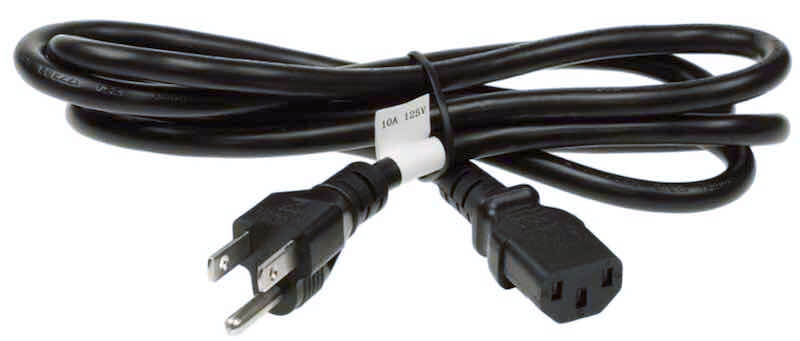

# Cords

*When something is called a cord, it is usually in reference to something carrying electricity to power a device.*

### IEC Cords
*A very common power cord configuration.*

### AC Adapters
*A converter that takes AC and turns it into DC to power devices.*

### 