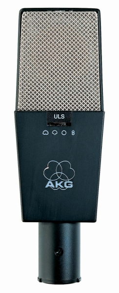

# AKG C414B-ULS

**Pickup pattern:** Switchable between hypercardioid, cardioid, omnidirectional, or bidirectional

#### Notes:
- Widely used to test against other mics
- Good for complex waveforms

#### Image

