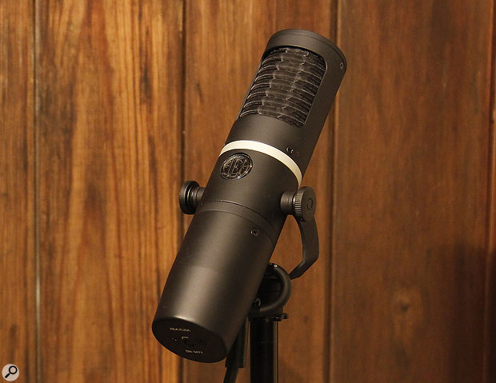

### Notes
- Optimized for use close up and on loud sources
- High pass filter for taming proximity effect
- Good for most things except kicks
- Extra care is needed to avoid feedback in line settings, but otherwise is one of a kind as it is a ribbon mic that can be used on a stage
- Not picky about preamps because it has an active pickup design

### External resources
- [Sound on Sound review](https://www.soundonsound.com/reviews/aea-ku5a)

### Images

![[AEA_KU5A_Specs_12-10-18.pdf]]