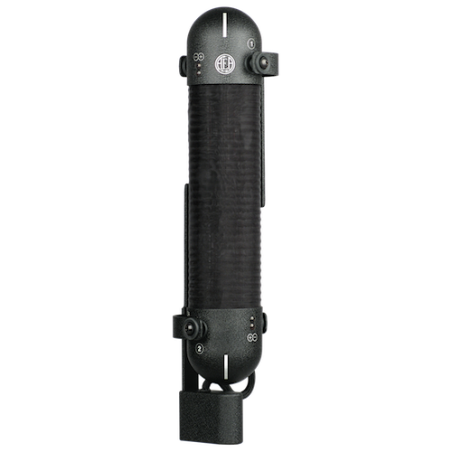
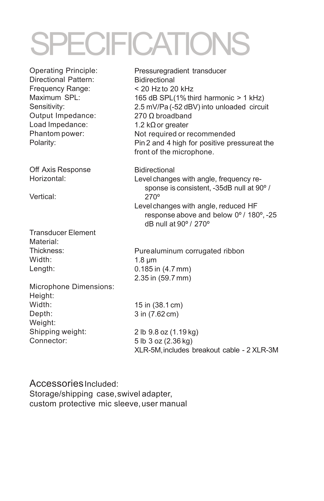
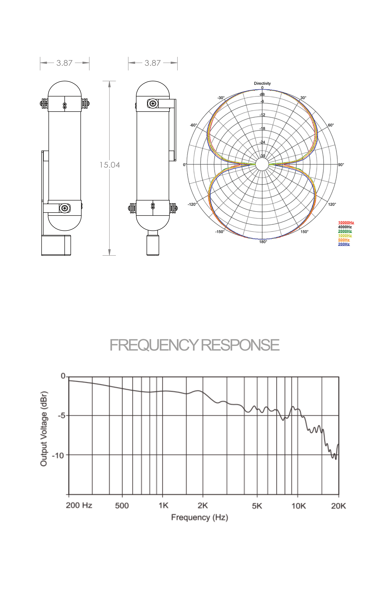

### Notes
- Two separate ribbon diaphragms allow you to use either Blumlein or M/S stereo recording configurations
- Easy to aim
- Superb stereo imaging

### External resources
- [AEA R88 MK2 Owner's Manual](https://aearibbonmics.com/wp-content/uploads/2018/01/AEA-R88-Specifications-2-3-18.pdf)

### Images

