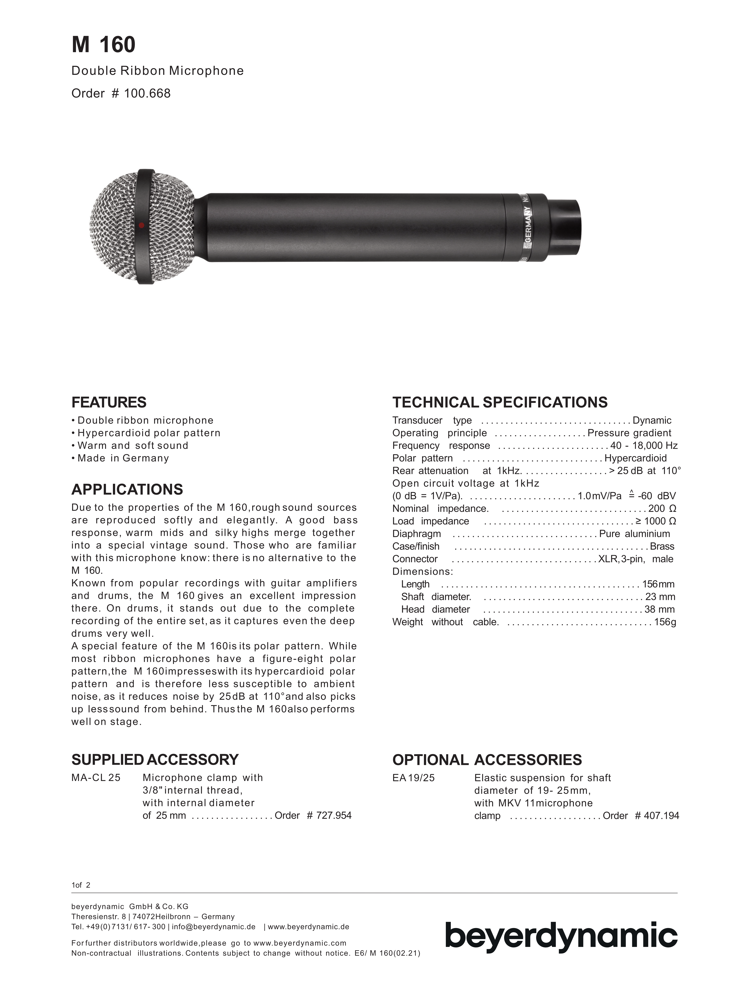

# Beyerdynamic M160

**Polar pattern:** Hypercardioid

**Freq. range:** 40 Hz to 18 kHz

### Notes
- Hypercardioid ribbon makes it less sensitive to ambient noise
- Wide frequency response range makes it ideal for capturing drums and electric guitars, even with distortion. Examples also include overheads, hi-hats, banjo, accoustic guitar, and *M/S modeling*

### External resources
[Beyerdynamic North America](https://north-america.beyerdynamic.com/m-160.html)

### Images

