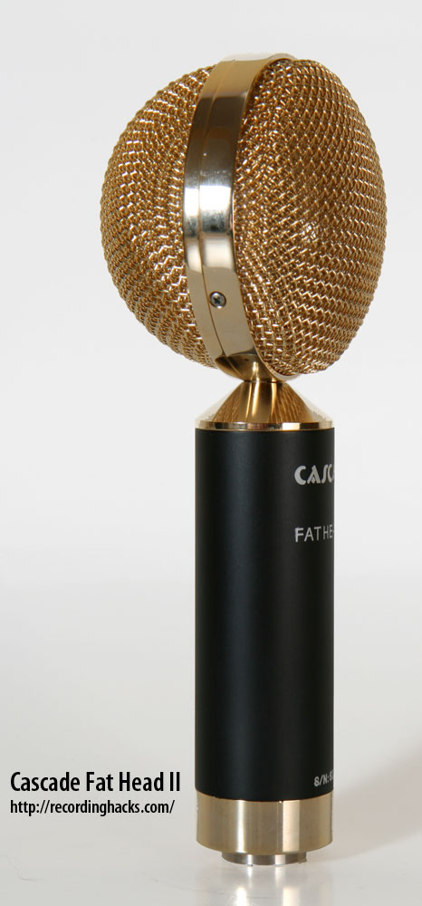

# Cascade Fat Head II

**Polar pattern:** Symmetrical figure-8/bidirectional

**Freq. range:** 25 Hz to 16 kHz

### Notes
- Has active and passive pickup modes
- Great with kicks, electric guitar amps, and individual horns in passive mode
- Active mode great with upright bass, piano (with careful positioning)
- Great for vocals that isn't in front of the mix
- Bidirectional pickup pattern

### External resources
- [Recording Hacks review](http://recordinghacks.com/microphones/Cascade/Fat-Head-II)

### Images

