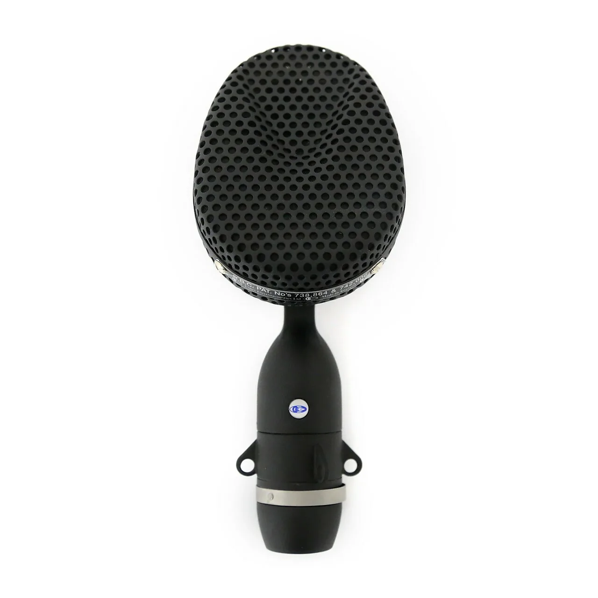
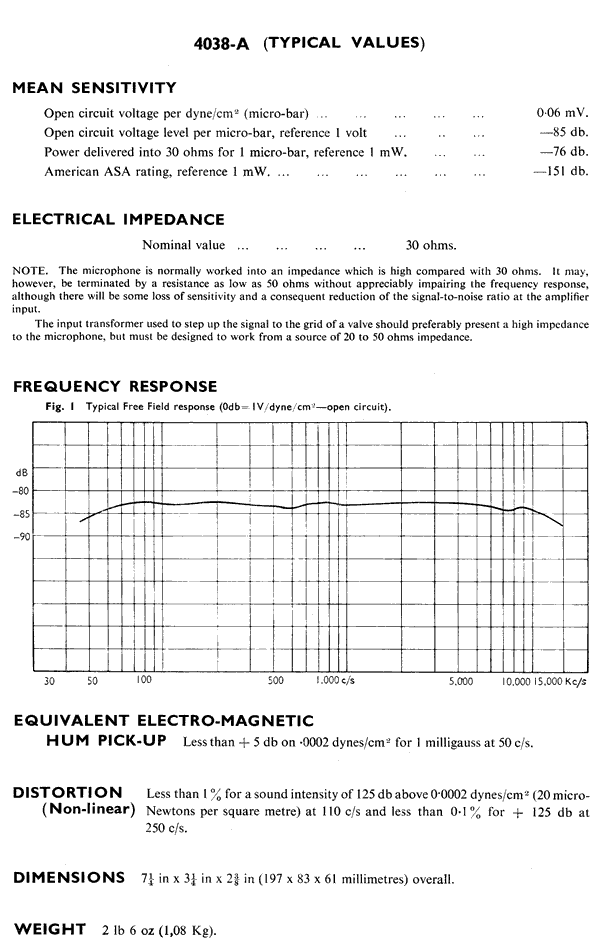

# Coles 4038

**Polar pattern:** Bidirectional

**Freq. response:** 30 Hz to 15 kHz

### Notes
- Pressure-gradient transducer
- Used for broadcasting
- Studio mic especially suitable for orchestral and all musical work because of smooth, wide-range frequency response, absence of transient distortion and relatively high sensitivity
- Hum neutralizing internal wiring and magnetic shielding
- Figure 8 polar pattern

### External resources
- [Coutant](https://www.coutant.org/coles/index.html)

### Images

