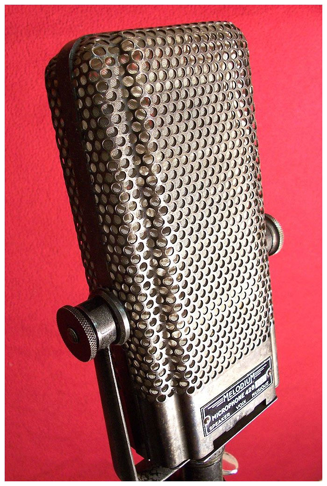

# Melodium 42bn

**Polar pattern:** Bidirectional

**Freq. response:** 30 Hz to 15 kHz

### Notes
- Largest ribbon
- Enormous proximity effect at the low end, audibly limited high-frequency response, and everything in between sounds natural
- Lovely room mic but too dark for vocals
- Dark, rich, warm and smooth sound

### External resources
- [Coutant](https://www.coutant.org/melodium/index.html)

### Images

