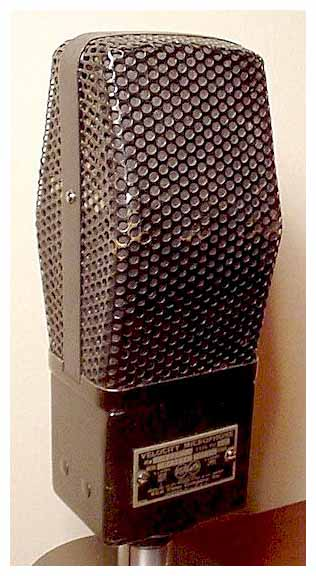

# RCA Type PB-90

**Polar pattern:** Bidirectional

**Freq. response:** 30 Hz to 6 kHz

### Notes
- General P.A. applications
- Wide frequency range (though not as wide as many other mics featured on this list)
- Lots of proximity effect

### External resources
- [Coutant](https://www.coutant.org/pb90/index.html)
- [Gearspace thread](https://gearspace.com/board/so-much-gear-so-little-time/1223436-1932-rca-pb-90-test.html)

### Images

At the time of writing, I could not find a polar pattern. However, there are multiple comparisons to the RCA 44. Being a velocity microphone as well, it seems likely that the PB-90 is bidirectional. 

