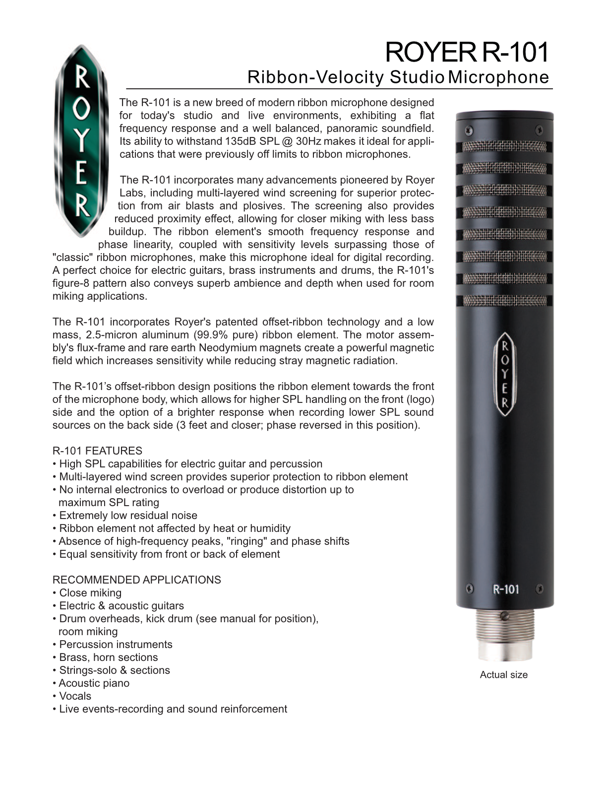
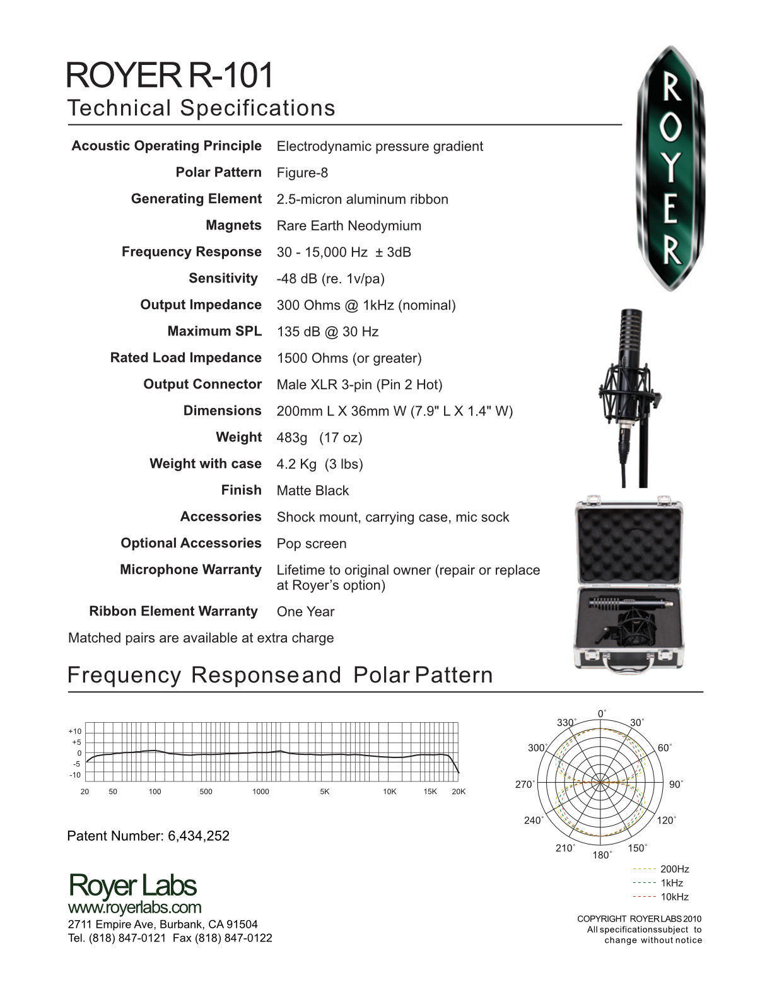

**Polar pattern:** Figure-8/Bidirectional
**Freq. response:** 30 Hz to 15 kHz

### Notes
- Works brilliantly with bright sources like brass, close strings, percussion, etc.
- Notibly brighter on rear of mic, intentional result of the offset ribbon transducer design. For example, crisper results on an accoustic guitar
- Great for vocals with resonance free top end. However, having a separate pop screen is a must have

### External resources
- [Royer R101 cutsheet](https://royerlabs.com/pdf/cutsheets/R-101cutsheet.pdf)

### Images

