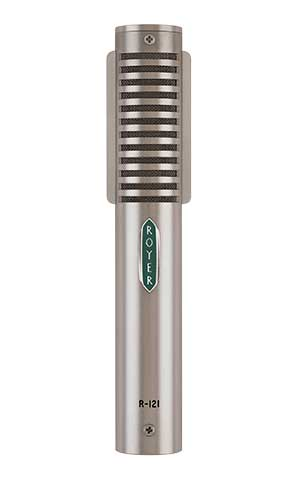
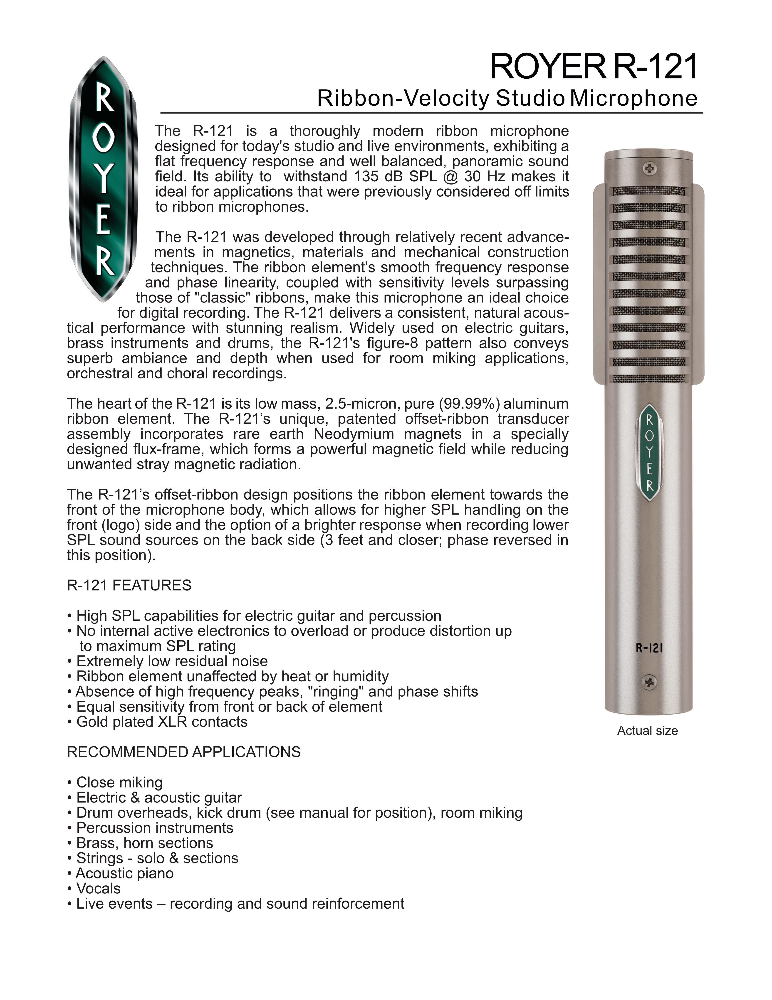
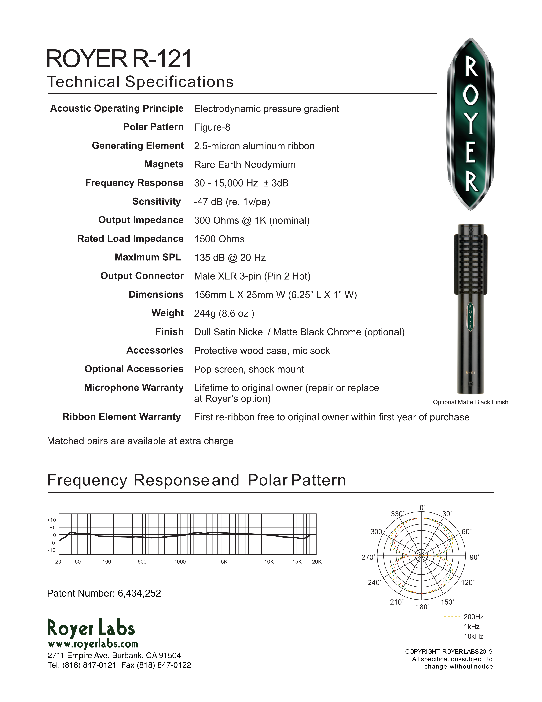

### Notes
- Can handle high sound pressure levels
- Good for brass, woodwinds, and voices
- A studio mic

### External resources
- [Royer Labs cutsheet](https://royerlabs.com/pdf/cutsheets/R-121cutsheet.pdf)

### Images

