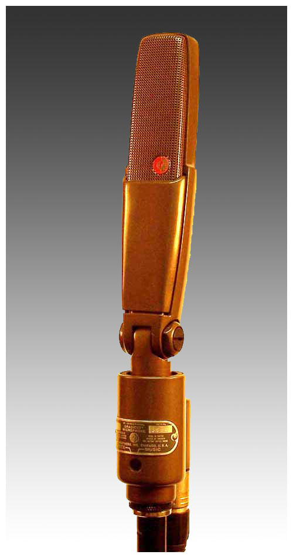
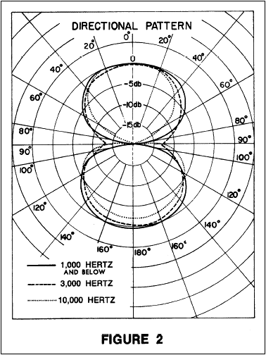
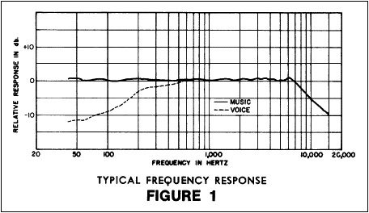
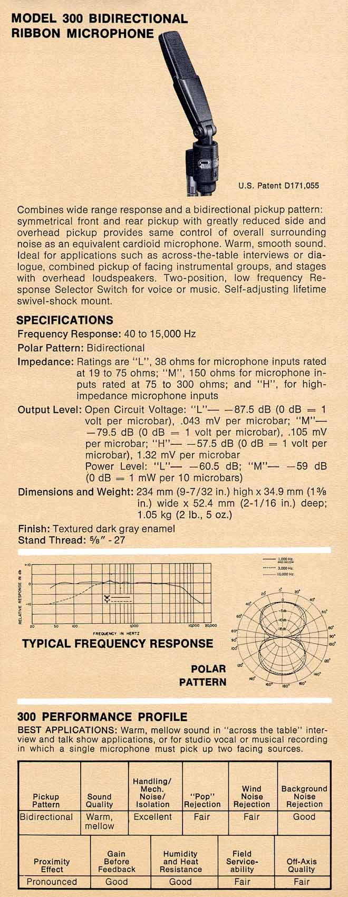

# Shure Model 300

**Polar pattern:** Bidirectional

**Freq. response:** 40 Hz to 15 kHz

### Notes
- Wide range frequency response
- Bidirectional polar pattern
- Excellent choice for broadcasting, recording studios, or critical sound reinforcement applications
- Symetrical front, rear, and reduced side pickup make it ideal for across the table interviews, dialogue, starges with loudspeakers directly to the side or overhead, and combined pickup of instrumental groups in recording sessions
- Voice/music switch which provides either flat or rolled off low-frequency response and with an impedance-selection switch allowing the choice of 3 rated impedances. *L* = 38 ohms, *M* = 150 ohms, *H* = high impedance
- Built-in vibration isolator and internal ribbon protection

### External resources
- [Coutant](https://www.coutant.org/shure300/index.html)

### Images

