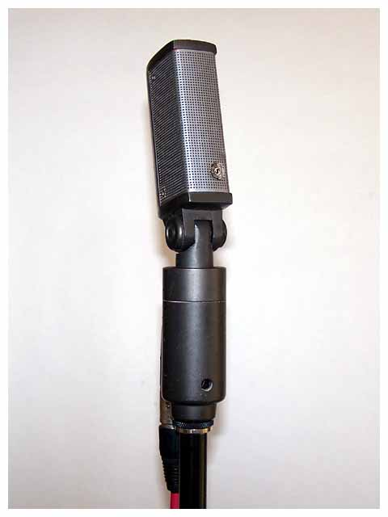
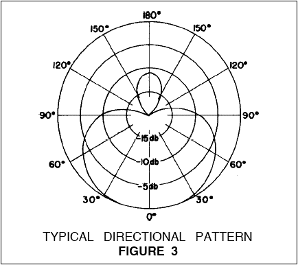
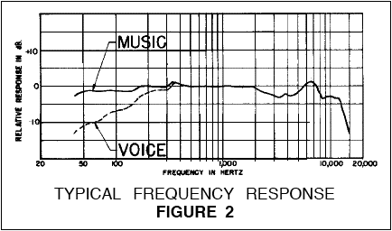

**Polar pattern:** Hypercardioid
**Freq. response:** 40 Hz to 15 kHz

### Notes
- Compact and rugged
- Unusually effected super cardioid pickup characteristic minimizes effects of studio accoustics and background noise
- Warm smooth sound from wide frequency response range making it well suited for both vocals and instruments.
- Low frequency response characteristic adjustible by means of a response selector switch
- Has a built in shock mount for quiet opperation
- Frequency response range of 40 - 15000 Hz

### External resources
- [Coutant](https://www.coutant.org/sm33/index.html)

### Images

