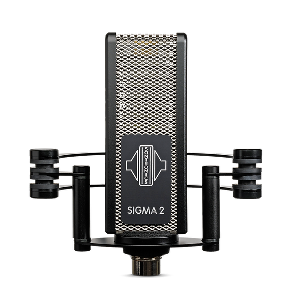
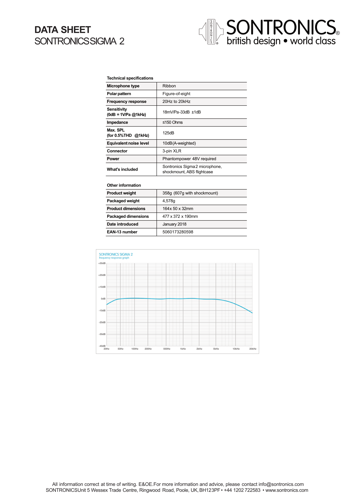

# Sontronics Sigma 2

**Polar pattern:** Bidirectional/figure-8

**Freq. response:** 20 Hz - 15 kHz w/ a 3 kHz rolloff

### Notes
- Active ribbon mic
- Broadcast, speech, making guitar cabinets, accousting guitar, drums and percussion (overheads), piano, and orchestral instruments
- Phantom powered

### External resources
- [Sound on Sound review](https://www.soundonsound.com/reviews/sontronics-sigma-2-delta-2)

### Images

